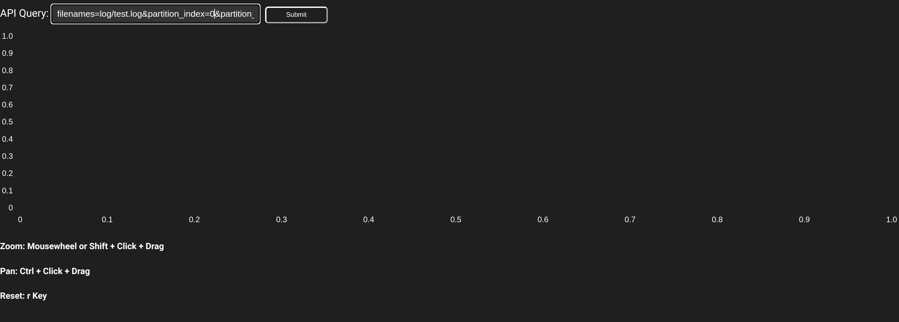

# learnadex

The 'learnadex' builds on the capabilities and framework provided by the [stochadex package](https://github.com/umbralcalc/stochadex) to enable maximum a posteriori (MAP) optimisation, dynamical process emulation and approximate inference of generalised stochastic models.

## Need more context and documentation?

The design, development, implementation details behind and practical documentation for the 'learnadex' can all be found in **Part 2** and **Part 4** of this very delightful book: [Diffusing Ideas](https://umbralcalc.github.io/diffusing-ideas/).

## Building and running the binary

```shell
# update the go modules
go mod tidy

# build the binary
go build -o bin/ ./cmd/learnadex

# run your configs
./bin/learnadex --settings ./cfg/settings_config.yaml \
--implementations ./cfg/implementations_config.yaml
```

## Building and running the logs explorer and visualisation app

```shell
# install the dependencies for and build the visualisation app
cd ./app && npm install && npm run build && cd ..

# build the binary
go build -o bin/ ./cmd/logsplorer

# run the app and checkout http://localhost:3000
./bin/logsplorer --config ./cfg/logsplorer_config.yaml
```



## Building and running the Docker containers (may need sudo)

```shell
# build the learnadex container
docker build -f Dockerfile.learnadex --tag learnadex .

# run the binary in the container with your configs
docker run learnadex --settings ./cfg/settings_config.yaml \
--implementations ./cfg/implementations_config.yaml

# build the logsplorer container
docker build -f Dockerfile.logsplorer --tag logsplorer .

# run the binary in the container with your config
docker run -p 8080:8080 logsplorer --config ./cfg/logsplorer_config.yaml
```
